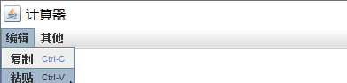

# Java 初学计算器

 

##### 介绍

- 仿造 Win 7 计算器，实现基本计算器的功能；

- 与标准计算器相比较大大的降低了数字计算的难度，并且提高了计算的准确度和精确度

- 支持复制 ，粘贴快捷键

##### 安装教程

1. 把本程序代码导入 Eclipse 或 IDEA，运行**main.java**文件即可！
2. **由于代码用到了 JDK1.6 的流式编程语法，因此至少要 JDK1.6 才能运行本程序**

##### 使用教程

1. 软件打开会初始化为 0

   

2. 剪切功能可以识别剪切版中是否是数字，若是数字则输出到文本框中，若不是数字则文本框中输出*”请粘贴数字“*

   

3. 在软件内对程序有简单说明

   
